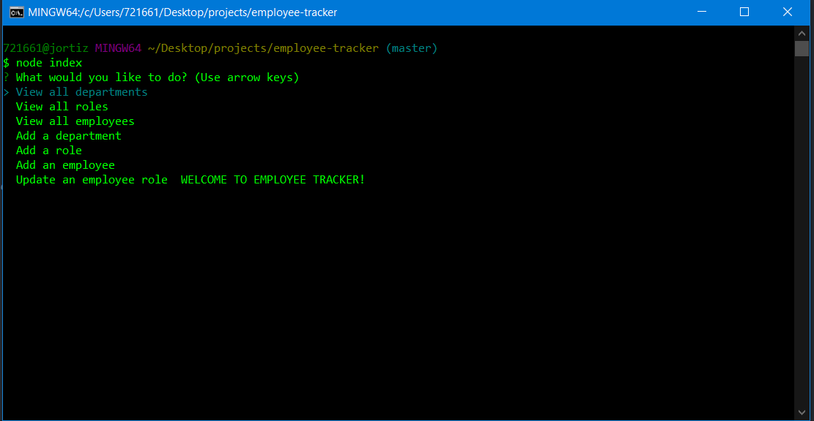

# Employee Tracker


## Description
Employee Traker is an application that helps you keep track of employees. Simply answer some questions and it will automatically update your employees database with the information. Try it for your employees!


## Table of Contents
* [Installation](#installation)
* [Usage](#usage)
* [Sample](#sample)
* [License](#license)
* [Contribution](#contribution)
* [Questions](#questions)

## Installation
Download the application and run:
```
npm install
```

## Usage
Open a terminal window, type in "node index" and answer the questions. Once done the application will generate the updated employees database. 

## Sample
Here is a sample screenshot:


Video demonstrating the application:
https://drive.google.com/file/d/1K4zE6-ahit-PT9SEv-m8bVz3i4DKzL_m/view


## License
Team Profile Generator is licensed under the MIT License.

## Questions
If you have any question please check out my GitHub https://github.com/ortizjavier10 or email me at ortiz.javier10@gmail.com .
